# RAG GenAI Document Assistant 🚀

A production-ready Retrieval-Augmented Generation (RAG) system deployed on Google Cloud Platform, featuring document upload, semantic search, and AI-powered Q&A with user isolation and authentication.

## 🌟 Features

### Backend API (FastAPI)
- **Secure Authentication**: API key-based authentication with header/query support
- **Multi-user Isolation**: Each user/session gets isolated document storage
- **Document Processing**: PDF upload, text extraction, chunking, and embedding
- **Vector Search**: ChromaDB for efficient semantic document retrieval
- **AI Integration**: Google Gemini models for intelligent Q&A
- **Redis Caching**: Response caching for improved performance
- **Comprehensive API**: Health checks, user management, debugging endpoints

### Frontend Interface (Streamlit)
- **User-Friendly UI**: Clean, intuitive interface for document management
- **Real-time Chat**: Interactive Q&A with uploaded documents
- **Document Management**: Upload, view, and delete documents
- **Session Management**: Persistent user sessions with unique IDs
- **Analytics Dashboard**: Usage statistics and conversation history
- **Responsive Design**: Works on desktop and mobile devices

## 🏗️ Architecture

```mermaid
flowchart TD
    A[📱 Streamlit UI<br/><small>Cloud Run</small>] -->|Query| B[⚡ FastAPI Backend<br/><small>Cloud Run</small>]
    B -->|Generate Response| C[🤖 Google Gemini API]
    B -->|Semantic Search| D[🗄️ FAISS Vector Store]
    D -->|Store/Load| E[☁️ Google Cloud Storage]
    C -->|Response| B
    B -->|Answer| A
    
    style A fill:#ff6b6b,color:#fff
    style B fill:#4ecdc4,color:#fff
    style C fill:#45b7d1,color:#fff
    style D fill:#96ceb4,color:#000
    style E fill:#feca57,color:#000
```




## 📋 Prerequisites

- Python 3.10+
- Google Cloud Account with billing enabled
- Google Gemini API key
- Git installed

## 🚀 Quick Start

### 1. Clone the Repository

```bash
git clone https://github.com/yourusername/rag-genai-gcp.git
cd rag-genai-gcp
```

### 2. Set Up Environment Variables
# Create .env file

```bash
cp .env.example .env

# Edit .env with your credentials
nano .env
```
Required environment variables:

- GOOGLE_API_KEY=your_gemini_api_key
- ALLOWED_API_KEYS=your_backend_api_key
- REDIS_URL=redis://localhost:6379  # Optional
- DEBUG_MODE=false

### 3. Install Dependencies

```bash
pip install -r requirements.txt
```
### 4. Local Development

Backend (FastAPI)
```bash
cd backend
uvicorn main:app --reload --host 0.0.0.0 --port 8080
```

Frontend (Streamlit)

```bash
streamlit run app.py
```

## ☁️ Google Cloud Deployment

### 1. Set Up Google Cloud

```bash
# Install Google Cloud SDK
# Configure your project
gcloud config set project YOUR_PROJECT_ID
gcloud auth login
gcloud auth configure-docker
```
### 2. Deploy Backend API

```bash
# Deploy to Cloud Run
gcloud run deploy rag-api \
  --source . \
  --region=us-central1 \
  --set-env-vars="DEBUG_MODE=true,GOOGLE_API_KEY=YOUR_KEY,ALLOWED_API_KEYS=YOUR_API_KEY" \
  --allow-unauthenticated \
  --port=8080
```

### 3. Deploy Frontend UI

```bash
# Deploy Streamlit to Cloud Run
gcloud run deploy rag-ui \
  --source . \
  --region=us-central1 \
  --set-env-vars="API_KEY=YOUR_API_KEY,RAG_API_URL=YOUR_BACKEND_URL" \
  --allow-unauthenticated \
  --port=8501
```

## 🔧 Configuration

## Backend API Endpoints

| Method | Endpoint | Description |
|--------|----------|-------------|
| GET | `/health` | Health check |
| POST | `/upload` | Upload PDF document |
| POST | `/query` | Query documents |
| GET | `/user/documents` | Get user documents |
| DELETE | `/user/documents/clear` | Clear user documents |
| GET | `/user/stats` | User statistics |
| GET | `/debug/embeddings` | Debug embedding system |
| GET | `/debug/vectorstore` | Debug vector store |

### Authentication
- API keys are required for all endpoints except `/health`
- Add header: `X-API-Key: your-api-key`
- Or query parameter: `?api_key=your-api-key`

## 📁 Project Structure


- **rag-genai-gcp/**
  - **app/**
    - **rag/**
      - `__init__.py`
      - `loader.py` - PDF loading and chunking
      - `embedder.py` - Text embedding with sentence-transformers
      - `vector_store.py` - ChromaDB vector store operations
      - `vector_store_old.py` - Legacy vector store implementation
    - `__init__.py`
  - **documents/**
    - `dot_Tracker2023.pdf` - Example PDF document
  - **streamlit-ui/**
    - **.streamlit/**
      - `secrets.toml` - Streamlit configuration
    - `app.py` - Streamlit frontend application
    - `requirements.txt` - UI dependencies

## 🛠️ Development
## Adding New Features
1. Create feature branch: git checkout -b feature/your-feature

2. Make changes and test locally

3. Run tests: pytest tests/

4. Submit pull request

## Testing

```bash
# Run backend tests
pytest tests/backend/

# Run frontend tests
pytest tests/frontend/

# Run all tests
pytest
```

## Code Quality

```bash
# Format code
black .
isort .

# Lint code
flake8
pylint app/
```

## 🔒 Security Considerations
- API keys are stored as environment variables, not in code

- User data is isolated by session ID

- CORS is configured for production domains

- Rate limiting is implemented on sensitive endpoints

- Input validation on all API endpoints

## 📊 Performance Optimization

- Caching: Redis caching for frequent queries

- Batch Processing: Parallel document processing

- Compression: Gzip compression for API responses

- Connection Pooling: Database connection reuse

- CDN: Static assets served via CDN

## 🚨 Troubleshooting
### Common Issues
### 1. API Key Issues

Error: 401 Unauthorized
Fix: Ensure API key is correctly set in headers

### 2. Document Upload Fails

Error: 500 Internal Server Error
Fix: Check if ChromaDB is initialized properly

### 3.Slow Responses

Issue: High latency on first query
Fix: Enable caching and pre-warm services

## Checking Logs

```bash
# View backend logs
gcloud beta run services logs read rag-api --region=us-central1

# View frontend logs
gcloud beta run services logs read rag-ui --region=us-central1
```

## 📈 Monitoring
### Built-in Monitoring
### Health check endpoints

- Response time metrics

- Error rate tracking

- User activity logs

### Google Cloud Monitoring
- Cloud Run metrics

- Error reporting

- Performance dashboards

- Alerting policies

## 🤝 Contributing
- Fork the repository

- Create a feature branch

- Commit your changes

- Push to the branch

- Open a Pull Request

## Development Guidelines

- Follow PEP 8 style guide

- Write unit tests for new features

- Update documentation

- Use descriptive commit messages


